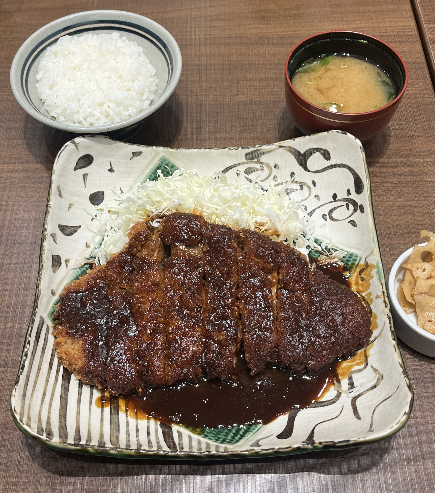

# Nagoya Miso Katsu (味噌カツ)

**Serves:** 4  
**Prep:** ~45 minutes  
**Cook:** ~20 minutes  
**Total:** ~65 minutes  
**Style:** Nagoya, Aichi, Japan

> Crispy pork cutlets (tonkatsu) served with a rich, sweet-savory red miso sauce and shredded cabbage.

**Source:** [Just One Cookbook — Miso Katsu](https://www.justonecookbook.com/nagoya-miso-katsu/)

---

## Ingredients

### Tonkatsu

- ½ head green cabbage
- 4 pork chops boneless pork loin, about ½-inch thick (approximately 1 lb / 454 g total)
- Diamond Crystal kosher salt, to taste
- Freshly ground black pepper, to taste
- ¼ cup all-purpose flour (4 Tbsp)
- 1 large egg
- 1 Tbsp water
- 1 cup panko
- Approximately 4 cups neutral oil, for deep-frying

### Miso Sauce

This recipe uses **double the original sauce quantity** to provide a more generous amount for four pork chops.

- 2 Tbsp mirin
- 4 Tbsp sake
- 1 cup (240 ml) **unsalted dashi**
- 4 Tbsp sugar
- ½ cup (8 Tbsp) Hatcho miso or strong red miso

### If Using Powdered Dashi

The original recipe assumes plain, unsalted dashi.

For powdered dashi such as Hondashi:

- Start with ¼ tsp dashi powder mixed with 1 cup (240 ml) water.
- If the sauce needs more dashi flavor, increase the powder slightly next time.
- Avoid preparing dashi at the full package-strength ratio. Powdered dashi often contains salt, and miso is already salty.

**Important:** If the sauce is too salty, dilute it with plain water or unsalted dashi, not more dashi powder.

---

## Instructions

## 1. Prepare the Cabbage

1. Cut or shred the cabbage into thin slices.
2. Wash under cold running water.
3. Drain thoroughly.
4. Refrigerate until ready to serve.

Keeping the cabbage cold and crisp provides a refreshing contrast to the hot tonkatsu and rich miso sauce.

---

## 2. Make the Miso Sauce

1. Add the mirin and sake to a small saucepan.
2. Bring to a brief boil over medium-high heat to cook off some of the alcohol.
3. Lower the heat.
4. Add the sugar, dashi, and miso.
5. Stir thoroughly with a silicone spatula or whisk until the miso is completely incorporated.
6. Cook gently over low heat for about **3 minutes**, stirring frequently so the miso does not scorch.
7. Remove from the heat when the sauce has thickened slightly.

### Adjusting the Sauce

The finished sauce should be thick enough to coat the tonkatsu but still pour easily.

**If it is too thick:**

- Add a little water or unsalted dashi.
- Stir and reheat gently if necessary.

**If it is too salty:**

- Add plain water or unsalted dashi, 1 Tbsp at a time, tasting after each addition.
- A little extra sugar can help balance the flavor, but dilution is the main way to reduce saltiness.

---

## 3. Prepare the Pork

1. Trim away excess fat from the pork chops if desired.
2. Look for the connective tissue between the meat and fat.
3. Make a few small cuts through the connective tissue around the edges of each chop.

These cuts help prevent the pork from curling during frying.

4. Pound both sides of each chop with a meat mallet.
   - If you don't have a meat mallet, carefully use the back of a knife.
5. After pounding, reshape the pork with your hands so each piece is reasonably even.
6. Season both sides with kosher salt and freshly ground black pepper.

---

## 4. Set Up the Breading

Prepare three stages:

1. **Flour:** All-purpose flour.
2. **Egg wash:** Whisk the egg with the water.
3. **Panko:** Place the panko in a shallow dish.

For each pork chop:

1. Coat the pork lightly in flour.
2. Shake off excess flour.
3. Dip into the beaten egg.
4. Coat thoroughly with panko.
5. Gently press the panko onto the pork.
6. Shake off loose crumbs.

---

## 5. First Fry

### Heat the Oil

1. Add approximately 4 cups of neutral oil to a suitable deep pot.
2. Heat over medium-high heat to approximately **350°F / 180°C**.

If you don't have a thermometer:

- Place the tip of a wooden chopstick into the oil. Small bubbles should form around it.
- Alternatively, drop a little panko into the oil. It should sink partway and quickly rise back up.

A thermometer is the most reliable way to maintain the correct temperature.

### Fry the Pork

1. Carefully lower the breaded pork into the oil.
2. Fry for approximately **1 minute** on the first side.
3. Flip.
4. Fry for approximately **1 minute** on the second side.

For pork chops thinner than about ¾ inch, reduce the first-frying time to roughly **45 seconds per side**, adjusting as necessary for thickness.

Keep the oil around 350°F / 180°C and avoid letting it get significantly hotter.

---

## 6. Rest the Pork

1. Remove the pork from the oil.
2. Hold each piece vertically for several seconds to allow excess oil to drain.
3. Place the pork on a wire rack. Paper towels can be used if necessary.
4. Let it rest for **4 minutes**.

While the pork rests, remove loose fried crumbs from the oil with a fine-mesh strainer.

---

## 7. Second Fry

1. Bring the oil back to approximately **350°F / 180°C**.
2. Return the pork to the oil.
3. Fry for about **1 minute total**, approximately **30 seconds per side**.
4. Remove the pork.
5. Hold it vertically for several seconds to drain excess oil.
6. Return it to the wire rack.
7. Let it rest for at least **3 minutes**.

**Food safety:** Check the thickest part of each pork chop with a food thermometer. Pork should reach an internal temperature of **145°F / 63°C**, followed by a rest of at least 3 minutes. Cooking time varies with thickness, so use temperature rather than appearance alone to determine doneness.

---

## 8. Slice and Serve

1. Place each tonkatsu on a cutting board.
2. Slice straight down with a sharp knife rather than using a back-and-forth sawing motion.
3. Arrange the sliced tonkatsu on plates.
4. Add the chilled shredded cabbage.
5. Pour the miso sauce over the tonkatsu or serve the sauce separately.
6. Serve immediately.

### Serving Idea

For a traditional Nagoya-style presentation, serve the tonkatsu with plenty of miso sauce and shredded cabbage alongside it.

You can also serve it over rice as **miso katsu donburi**.

---

## Important Notes

### Red Miso vs. Hatcho Miso

The original recipe specifically calls for **Hatcho miso**, which has a particularly dark, rich, bold flavor.

Regular Japanese red miso can also make a very good sauce, but the flavor will be somewhat different.

If using regular red miso:

- Start with the recipe as written.
- Taste before adding any extra salt.
- Adjust the thickness with unsalted dashi or water.
- If the sauce tastes overly salty, dilute it rather than adding more powdered dashi.

### Powdered Dashi

Most powdered dashi products contain salt, so they are not a direct 1:1 replacement for plain homemade dashi.

For this sauce, **weak dashi is preferable to strong dashi** because the miso is already the dominant salty, umami ingredient.

---

## Storage

### Miso Sauce

Store leftover sauce in an airtight container in the refrigerator.

The original recipe states that the sauce can be refrigerated for up to **2 weeks** and can also be frozen. For best quality and food safety, refrigerate promptly and use your judgment about storage time and condition.

The sauce can also be reused as:

- A dipping sauce for vegetables
- A sauce for hot pot ingredients
- A sauce for konnyaku
- A marinade or glaze for fish
- A sauce for udon

### Tonkatsu

For the best texture, eat the tonkatsu fresh.

---

## Quick Reference

### Miso Sauce

| Ingredient | Amount for 4 servings |
|---|---:|
| Mirin | 2 Tbsp |
| Sake | 4 Tbsp |
| Unsalted dashi | 1 cup / 240 ml |
| Sugar | 4 Tbsp |
| Hatcho or red miso | ½ cup / 8 Tbsp |

**Powdered dashi starting point:** ¼ tsp per 1 cup / 240 ml water.

### Frying

| Step | Temperature | Approximate Time |
|---|---|---:|
| First side | 350°F / 180°C | 1 minute |
| Second side | 350°F / 180°C | 1 minute |
| First rest | — | 4 minutes |
| Second fry | 350°F / 180°C | 30 seconds per side |
| Final rest | — | At least 3 minutes |

**Final doneness:** Pork must reach 145°F / 63°C internally, followed by at least a 3-minute rest.

---

## Source

Just One Cookbook, **"Miso Katsu (Video) 味噌カツ"**, by Namiko Hirasawa Chen, updated February 15, 2025.

https://www.justonecookbook.com/nagoya-miso-katsu/