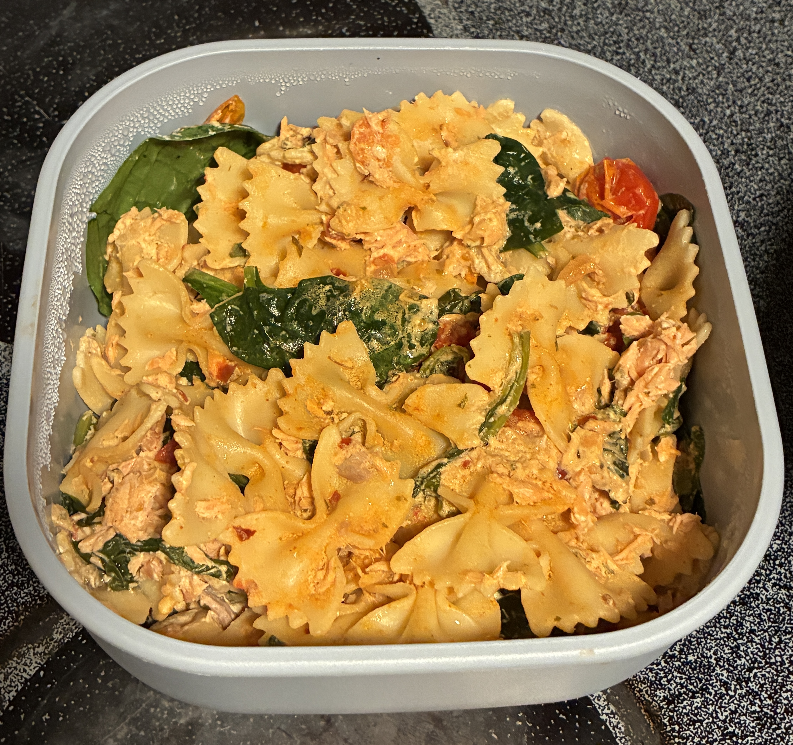

# Lemon Boursin Salmon Pasta Meal Prep

**Serves:** 6
**Prep Time:** ~10 minutes
**Cook Time:** ~30 minutes
**Total Time:** ~40 minutes
**Style:** Meal Prep

> Oven-baked salmon, cherry tomatoes, garlic, and Boursin Garlic & Fine Herbs mixed with rotini pasta and spinach for a creamy, easy meal-prep dish.

---

## Ingredients

### Main Ingredients

* 24 oz sockeye salmon
* 8 oz dry rotini pasta
* 1 (5.2 oz) Boursin Garlic & Fine Herbs
* 2 pints cherry tomatoes
* 1–2 cups baby spinach
* 1 medium shallot, thinly sliced
* 2 tbsp garlic, minced
* 1 tbsp olive oil
* 1 lemon, juiced

### Seasoning Blend

* 1½ tsp dried oregano
* 1 tsp smoked paprika
* ½ tsp onion powder
* ½ tsp red pepper flakes, optional
* ½ tsp salt, or to taste

### Toppings / Garnishes

* Fresh parsley, optional

---

## Instructions

### 1. Prepare

* Preheat oven to **400°F**.
* Place the Boursin in the center of a **9×13 baking dish**.
* Add the salmon, cherry tomatoes, sliced shallot, and minced garlic around the Boursin.
* Drizzle everything with olive oil.
* Sprinkle with oregano, smoked paprika, onion powder, red pepper flakes, and salt.

### 2. Bake

* Bake for **25–30 minutes**, or until the salmon reaches an internal temperature of **145°F** and the tomatoes are soft.

### 3. Cook the Pasta

* While the salmon is baking, cook the rotini according to the package directions until **al dente**.
* Drain and set aside.

### 4. Make the Creamy Salmon Mixture

* Remove the baking dish from the oven.
* Squeeze the lemon juice over everything.
* Burst the softened tomatoes with a spoon.
* Flake the salmon into smaller pieces.
* Mix everything together with the Boursin until the sauce is creamy and well combined.

### 5. Add Pasta and Spinach

* Add the cooked rotini and baby spinach to the baking dish.
* Toss everything together until the pasta is coated and the spinach has wilted.

### 6. Portion and Serve

* Divide evenly between **6 meal-prep containers**.
* Top with fresh parsley if desired.
* Enjoy!

---

## Notes

* Adjust the red pepper flakes to taste, or leave them out for a milder dish.
* The tomatoes release liquid as they bake, helping create the creamy sauce.
* If the mixture seems too thick, add a small splash of pasta water when mixing.

## Variations

* Substitute another type of salmon if desired.
* Use penne, fusilli, or another short pasta instead of rotini.
* Add extra spinach or other vegetables.
* Add Parmesan cheese for an extra savory flavor.

## Meal Prep

* **Storage:** Refrigerate in airtight containers.
* **Reheating:** Reheat in the microwave until heated through. Add a small splash of water if the pasta seems dry.
* **Freezer:** Not recommended because of the creamy Boursin sauce and fresh spinach.

## Quick Reference

| Item                        |          Amount |
| --------------------------- | --------------: |
| Salmon                      |           24 oz |
| Rotini                      |        8 oz dry |
| Boursin Garlic & Fine Herbs |          5.2 oz |
| Cherry tomatoes             |         2 pints |
| Baby spinach                |        1–2 cups |
| Shallot                     |        1 medium |
| Garlic                      |          2 tbsp |
| Olive oil                   |          1 tbsp |
| Lemon                       |               1 |
| Dried oregano               |          1½ tsp |
| Smoked paprika              |           1 tsp |
| Onion powder                |           ½ tsp |
| Red pepper flakes           | ½ tsp, optional |
| Salt                        |           ½ tsp |
| Servings                    |               6 |
| Oven temperature            |           400°F |
| Cook time                   |       25–30 min |
